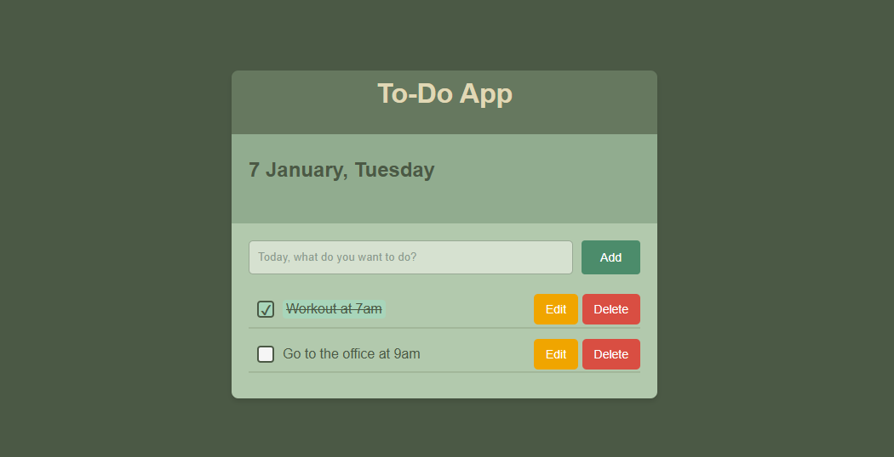

# 📝 Task Manager - Organize Your Day

## Result
[Check out the live version here](https://047hashim.github.io/my-todo-app/)

## About this project

This To-Do App is a beginner-friendly project developed as part of my journey into web development. As a new learner, I have built this app to practice my skills and improve my understanding of HTML, CSS, and JavaScript.
### In this project, I’ve focused on:

- **Task management**: Users can add, edit, mark as complete, and remove tasks.
- **JavaScript fundamentals**: I’ve used JavaScript’s Date object to display the current date, which automatically updates to reflect the present day.
 **Responsive design**: The app is fully responsive, adapting to various screen sizes for both desktop and mobile views.
- **Interactive elements**: The app includes dynamic interactions such as task completion with checkboxes and visually engaging styles to enhance the user experience.

